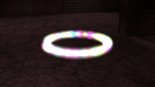

# Particles API
This Particle System API is designed to implement particle effects. The API provides functions to register particle effects, create and manipulate particle systems, and work with individual particles.

## Registering a New Particle Effect

To register a new particle effect, use the `ParticleEffect_Register` function.

```cpp
ParticleEffect_Register("my-effect", EMIT_RATE, PARTICLE_LIFETIME, MAX_PARTICLES);
```

- `EMIT_RATE`: Emit rate of particles per second.
- `PARTICLE_LIFETIME`: Lifetime of each particle in seconds.
- `MAX_PARTICLES`: Maximum number of particles in the effect.

## Controlling Particle Effects

To control your effect you need hooks. Use the `ParticleEffect_RegisterHook` function with `ParticleEffectHook_` constants to hook events.

```cpp
ParticleEffect_RegisterHook("my-effect", ParticleEffectHook_Particle_Think, "@Effect_Particle_Think");
```

## Spawning the Particle Effect System

To spawn the system at a specific origin use the `ParticleSystem_Create` function.

```cpp
new ParticleSystem:sParticleSystem = ParticleSystem_Create("my-effect", vecOrigin);
```

## Removing the Particle Effect System

To remove and free memory, destroy the system using `ParticleSystem_Destroy`.

```cpp
ParticleSystem_Destroy(sParticleSystem);
```

## Enabling/Disabling the Particle Effect System

Enable or disable the particle system with `ParticleSystem_Activate` and `ParticleSystem_Deactivate` methods.

```cpp
ParticleSystem_Activate(sParticleSystem);
ParticleSystem_Deactivate(sParticleSystem);
```

## Simple Particle Effect Example

Here is a simple example demonstrating API functionality:



```cpp
#include <amxmodx>
#include <fakemeta>
#include <xs>

#include <api_particles>

#define EFFECT_PARTICLE_LIFETIME 1.5
#define EFFECT_EMIT_RATE 0.01
#define EFFECT_MAX_PARTICLES floatround(EFFECT_PARTICLE_LIFETIME / EFFECT_EMIT_RATE, floatround_ceil)

// Particle model for the effect
new g_szParticleModel[] = "sprites/animglow01.spr";

public plugin_precache() {
    // Precache the particle model
    precache_model(g_szParticleModel);
    
    // Register the particle effect
    ParticleEffect_Register("colored-circle", EFFECT_EMIT_RATE, EFFECT_PARTICLE_LIFETIME, EFFECT_MAX_PARTICLES);
    
    // Register hooks for the particle effect
    ParticleEffect_RegisterHook("colored-circle", ParticleEffectHook_System_Init, "@Effect_System_Init");
    ParticleEffect_RegisterHook("colored-circle", ParticleEffectHook_Particle_Think, "@Effect_Particle_Think");
    ParticleEffect_RegisterHook("colored-circle", ParticleEffectHook_Particle_EntityInit, "@Effect_Particle_EntityInit");
}

public plugin_init() {
    // Plugin initialization
    register_plugin("[Particle] Colored Circle", "1.0.0", "Hedgehog Fog");
}

// Hook callback for system initialization
@Effect_System_Init(ParticleSystem:this) {
    // Set additional system parameters
    ParticleSystem_SetMember(this, "flRadius", 48.0);
}

// Hook callback for particle thinking
@Effect_Particle_Think(Particle:this) {
    // Get relevant time and system information
    static Float:flGameTime; flGameTime = get_gametime();
    static ParticleSystem:sSystem; sSystem = Particle_GetSystem(this);
    static Float:flCreatedTime; flCreatedTime = Particle_GetCreatedTime(this);
    static Float:flKillTime; flKillTime = Particle_GetKillTime(this);
    static Float:flTimeRatio; flTimeRatio = (flGameTime - flCreatedTime) / (flKillTime - flCreatedTime);

    // Calculate particle velocity in a circular pattern
    static Float:flAngle; flAngle = 2 * M_PI * flTimeRatio
    static Float:flRadius; flRadius = ParticleSystem_GetMember(sSystem, "flRadius");

    static Float:vecVelocity[3];
    vecVelocity[0] = flRadius * floatcos(flAngle);
    vecVelocity[1] = flRadius * floatsin(flAngle);
    vecVelocity[2] = 0.0;

    // Set the calculated velocity to create circular motion
    Particle_SetVelocity(this, vecVelocity);
}

// Hook callback for particle entity initialization
@Effect_Particle_EntityInit(Particle:this, pEntity) {
    // Set up rendering properties for each particle entity
    static iModelIndex; iModelIndex = engfunc(EngFunc_ModelIndex, g_szParticleModel);

    set_pev(pEntity, pev_rendermode, kRenderTransAdd);
    set_pev(pEntity, pev_renderfx, kRenderFxLightMultiplier);
    set_pev(pEntity, pev_scale, 0.065);
    set_pev(pEntity, pev_modelindex, iModelIndex);
    set_pev(pEntity, pev_renderamt, 220.0);
    set_pev(pEntity, pev_framerate, 1.0);

    engfunc(EngFunc_SetModel, pEntity, g_szParticleModel);

    // Randomize color for each particle entity
    static Float:rgflColor[3];
    for (new i = 0; i < 3; ++i) rgflColor[i] = random_float(0.0, 255.0);

    set_pev(pEntity, pev_rendercolor, rgflColor);
}
```


Certainly! Here's an improved version:

## Testing Your Effect In-Game

To evaluate and visualize your particle effect within the game environment, you can use the `particle_create` console command, specifying the name of your effect as the first argument.

**Example:**
```bash
particle_create "colored-circle"
```

This command triggers the creation and rendering of the "colored-circle" particle effect, allowing you to assess its appearance and behavior in real-time.
